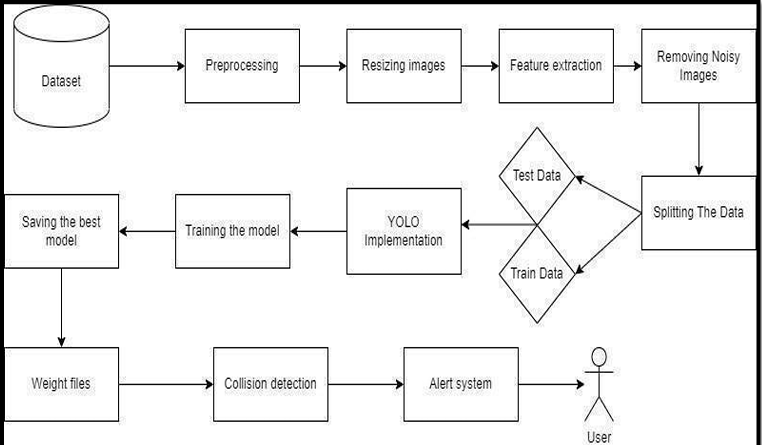
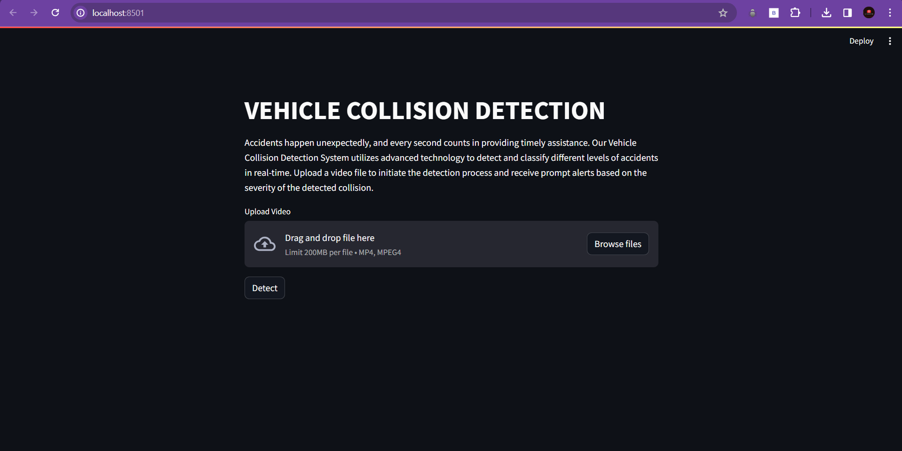
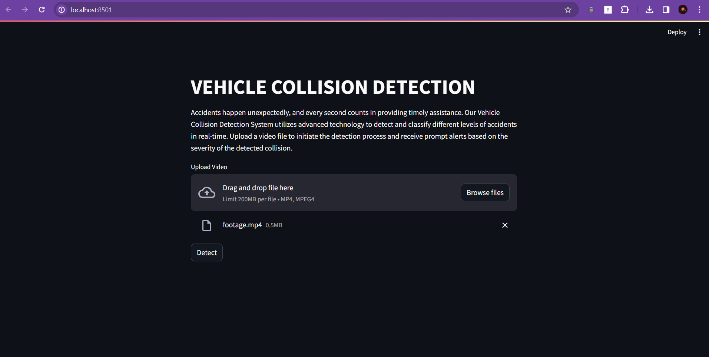
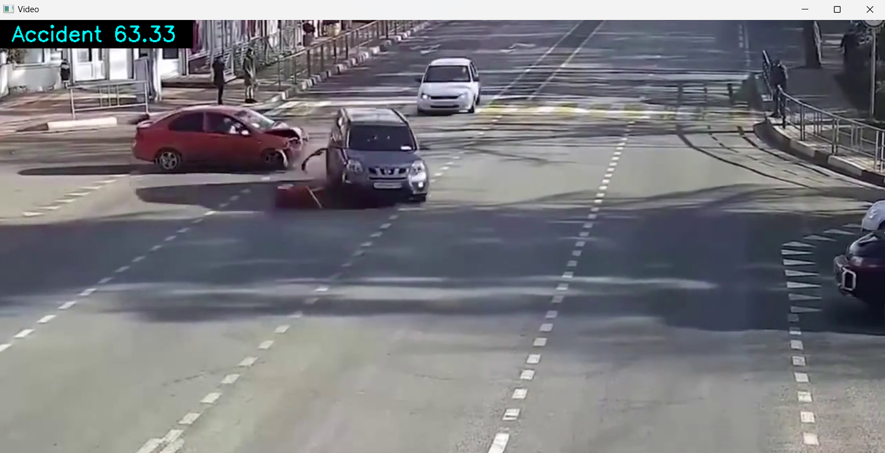
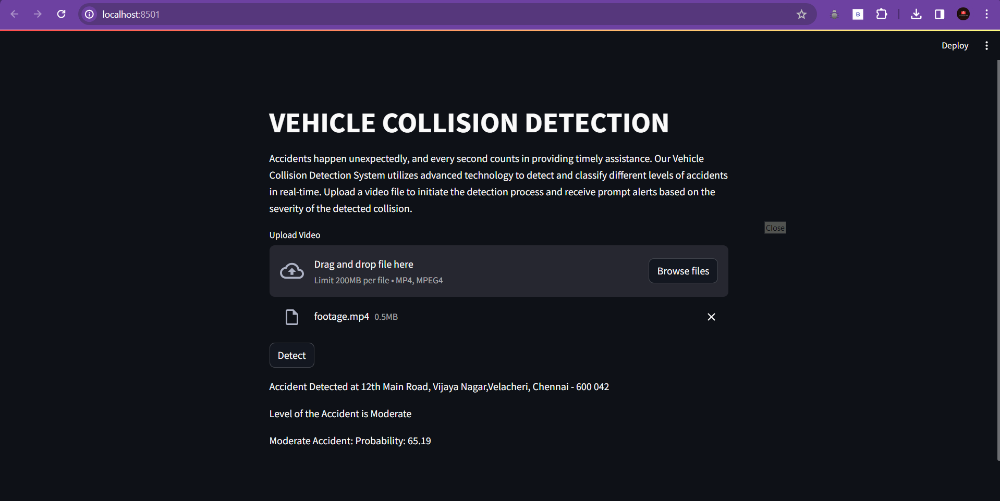
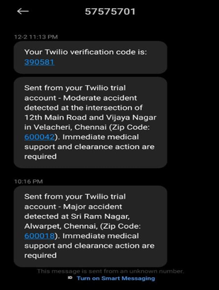

# Real-Time Vehicle Collision Detection with Alert System

## About

Real-Time Vehicle Collision Detection with Alert System is a project aimed at enhancing road safety by utilizing computer vision and machine learning techniques to detect vehicle collisions in real-time. The system is designed to automatically identify potential collisions and promptly alert nearby vehicles or emergency services, thereby reducing the risk of accidents and minimizing response times.

## Features

- Real-time vehicle collision detection using computer vision algorithms.
- Automated alert system for nearby vehicles and emergency services.
- Integration with dashboard cameras and surveillance systems for continuous monitoring.
- High accuracy and reliability in collision detection.
- Scalable architecture to accommodate varying traffic conditions and road environments.

## Requirements

- Operating System: Windows or Linux (64-bit) for compatibility with deep learning frameworks.
- Development Environment: Python 3.6 or later.
- Deep Learning Frameworks: TensorFlow or PyTorch for model training and inference.
- Image Processing Libraries: OpenCV for real-time image processing.
- Communication Protocols: MQTT or HTTP for alert notifications.
- Hardware: Dash cameras or surveillance cameras with internet connectivity.

## System Architecture

## Output

### HomeScreen for Interface

### Collision Detection

### Video Capture using OpenCV

### Prediction Results

### Collision Alert

## Results and Impact

The Real-Time Vehicle Collision Detection with Alert System significantly enhances road safety by providing proactive collision detection and alert capabilities. By promptly notifying nearby vehicles and emergency services about potential collisions, the system helps prevent accidents and mitigate their impact. Moreover, the project contributes to advancing the field of intelligent transportation systems and promoting the adoption of technology-driven solutions for road safety.

## Articles Published / References

[1] H. Shi and C. Liu, “A new foreground segmentation method for video analysis in different color spaces,” in 24th International Conference on Pattern Recognition, IEEE, 2018. 
[2] G. Liu, H. Shi, A. Kiani, A. Khreishah, J. Lee, N. Ansari, C. Liu, and M. M. Yousef, “Smart traffic monitoring system using computer vision and edge computing,” IEEE Transactions on Intelligent Transportation Systems, 2021. 
[3] H. Ghahremannezhad, H. Shi, and C. Liu, “Automatic road detection in traffic videos,” in 2020 IEEE Intl Conf on Parallel & Distributed Processing with Applications, Big Data & Cloud Computing, Sustainable Computing & Communications, Social Computing & Networking(ISPA/BDCloud/SocialCom/ SustainCom), pp. 777–784, IEEE, 2020. 
